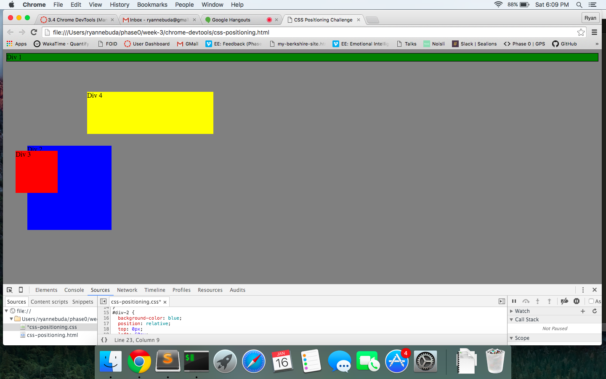
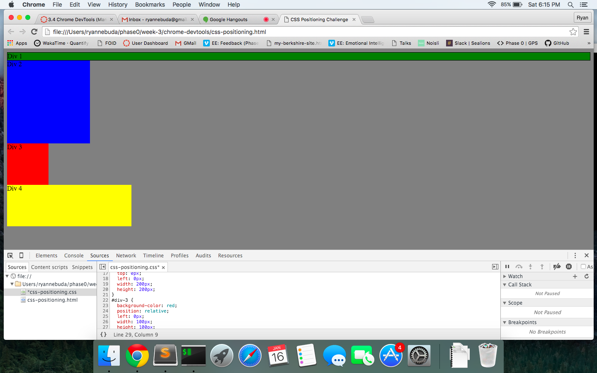
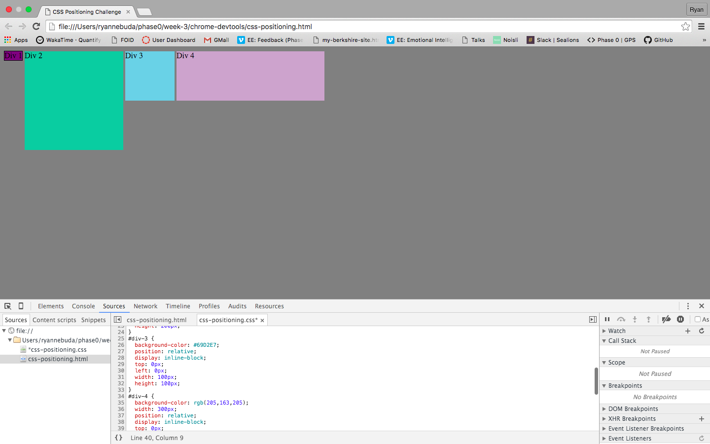
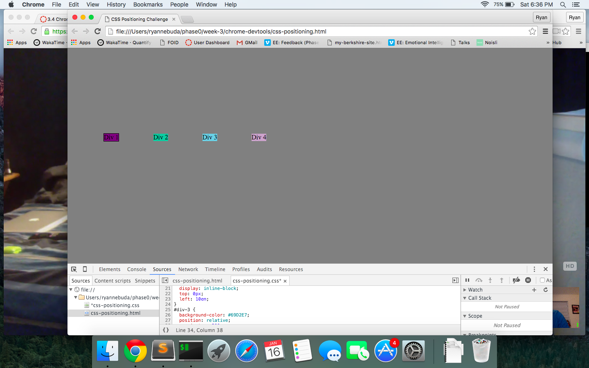
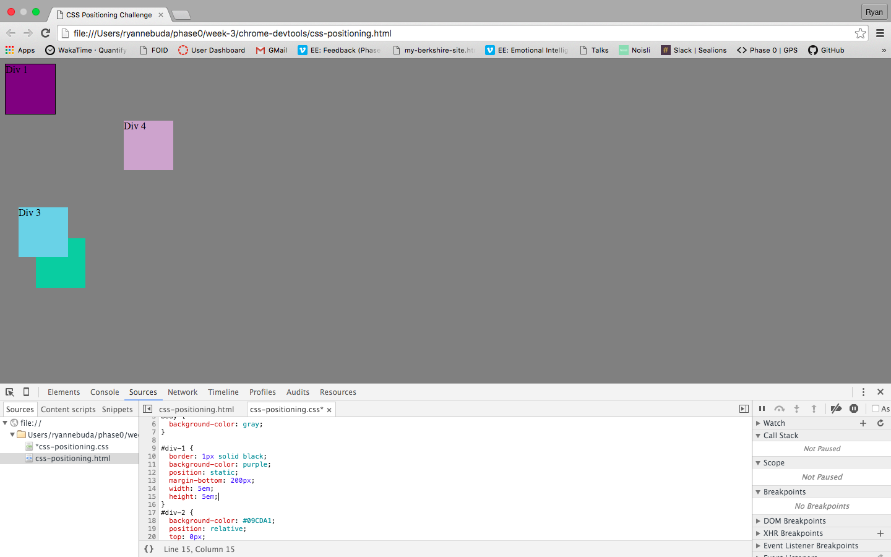
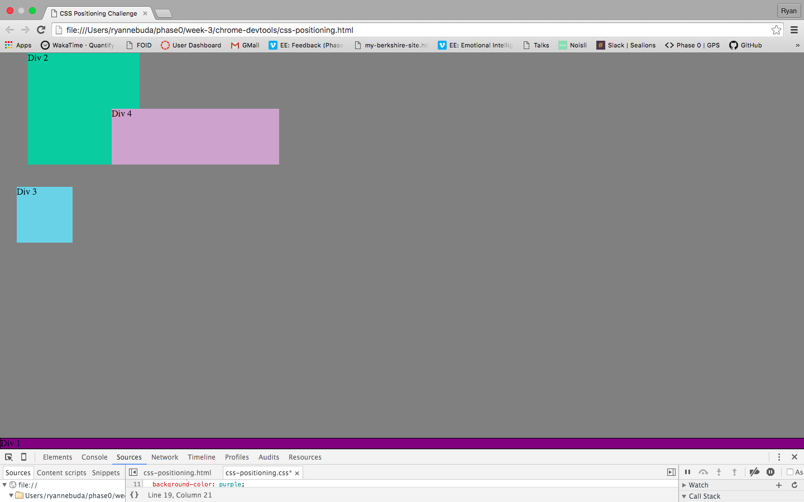
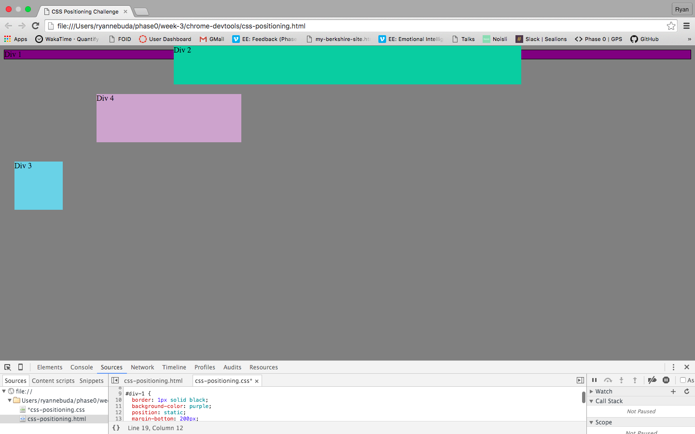
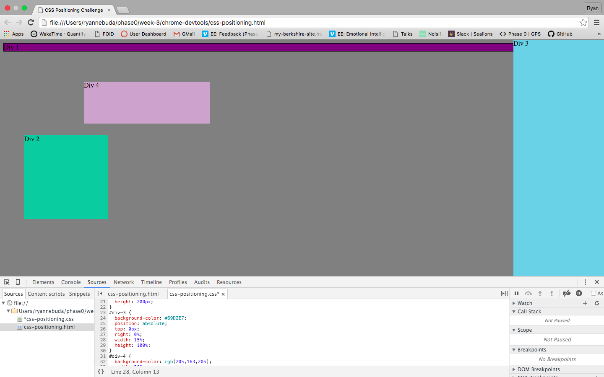
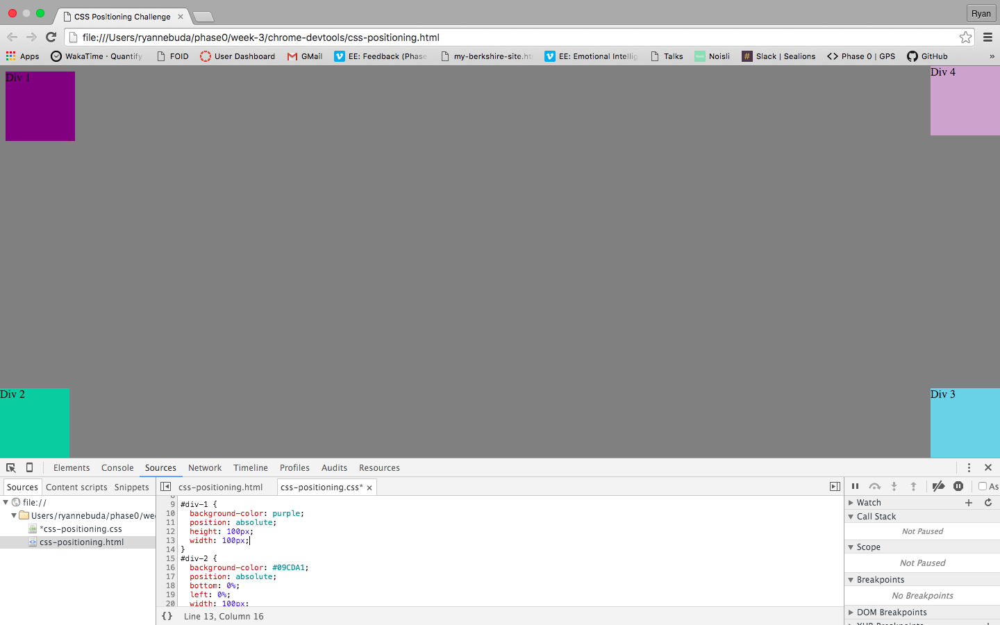

How can you use Chrome's DevTools inspector to help you format or position elements? Under the elements tab you can check and uncheck properties from the styles tab or edit a file within the Sources tab to change it live on the browser.

How can you resize elements on the DOM using CSS? Changing the height & width to either px or %.  

What are the differences between absolute, fixed, static, and relative positioning? Which did you find easiest to use? Which was most difficult? Static is by default, not affected by any other properties.  Fixed is set in a certain spot, will not move, can overlap & set by left, right cmds.  Relative is moved from it's normal or static position.  Moved by a left, right up etc cmd.  Absolute stays fixed and doesn't affect other elements of the page.  Relative was easiest to use.

What are the differences between margin, border, and padding? Margin will overlap with other margins that seperate two elements.  Padding will not overlap with other elements' padding.  Border is a styling element of what will surround an element.

What was your impression of this challenge overall? (love, hate, and why?) Good to play around with to try and get our results to match up.  I thought this would be extremely easy and some ended up taking more time than I originally thought.