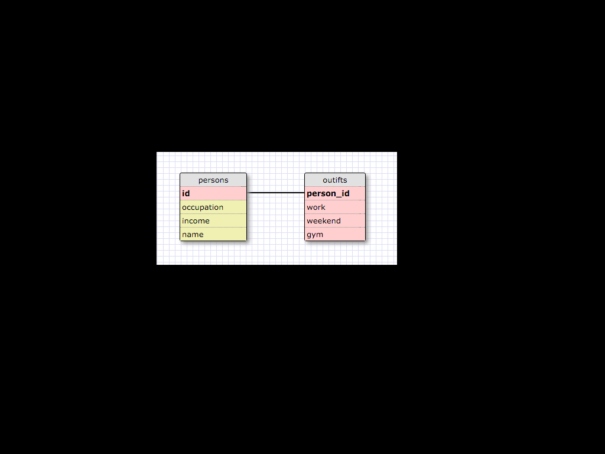

1. SELECT * FROM states;
2. SELECT * FROM regions;
3. SELECT state_name, population FROM states;
4. SELECT state_name, population FROM states ORDER BY population DESC;
5. SELECT state_name FROM states WHERE region_id = 7;
6. SELECT state_name, population_density
   ...> FROM states
   ...> WHERE population_density > 50
   ...> ORDER BY population_density ASC;
7. SELECT state_name
   ...> FROM states
   ...> WHERE population > 1000000 AND population < 1500000;
8. SELECT state_name, region_id
   ...> FROM states
   ...> ORDER BY region_id ASC;
9. SELECT region_name
   ...> FROM regions
   ...> WHERE region_name
   ...> LIKE '%Central%';
10. SELECT regions.region_name, states.state_name
   ...> FROM regions
   ...> JOIN states
   ...> ON regions.id = states.region_id;

What are databases for? Storing and accessing data.

What is a one-to-many relationship? when a database's tables are linked to each other by a common column name.  This is a primary to foreign key relationship.  In the above examples it's region_name to region_id.

What is a primary key? What is a foreign key? How can you determine which is which? Primary key is specific to the row of data it belongs to.  It cannot be a duplicate and cannot be NULL.  Foreign keys contain the primary key of another table in their database making them "foreign".  They can be NULL and do not need to be unique.

How can you select information out of a SQL database? What are some general guidelines for that? Always think what you're SELECTing and FROM what table.  Then think of what you want to pull and what conditions to align it with (WHERE).  If you want the data organized ORDER BY.  Very readable and almost like you're telling the command line a statement of what you're ultimately looking for.

