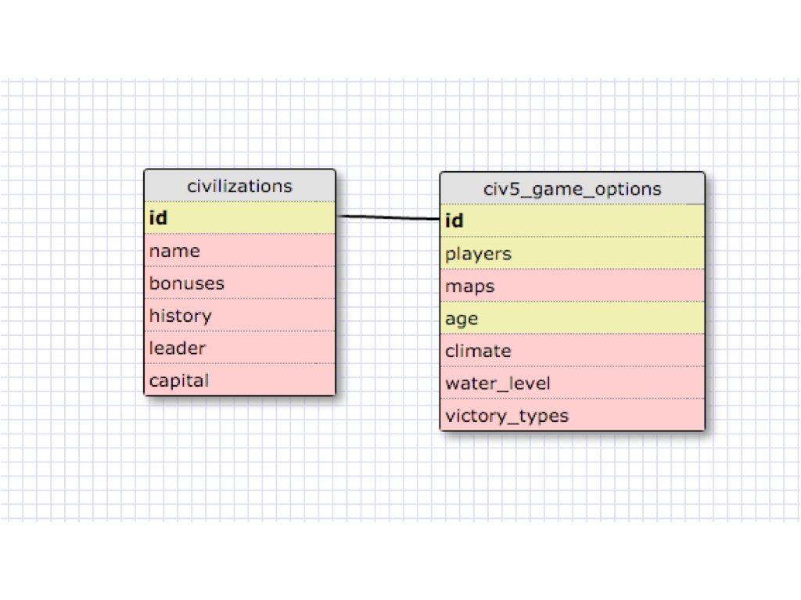
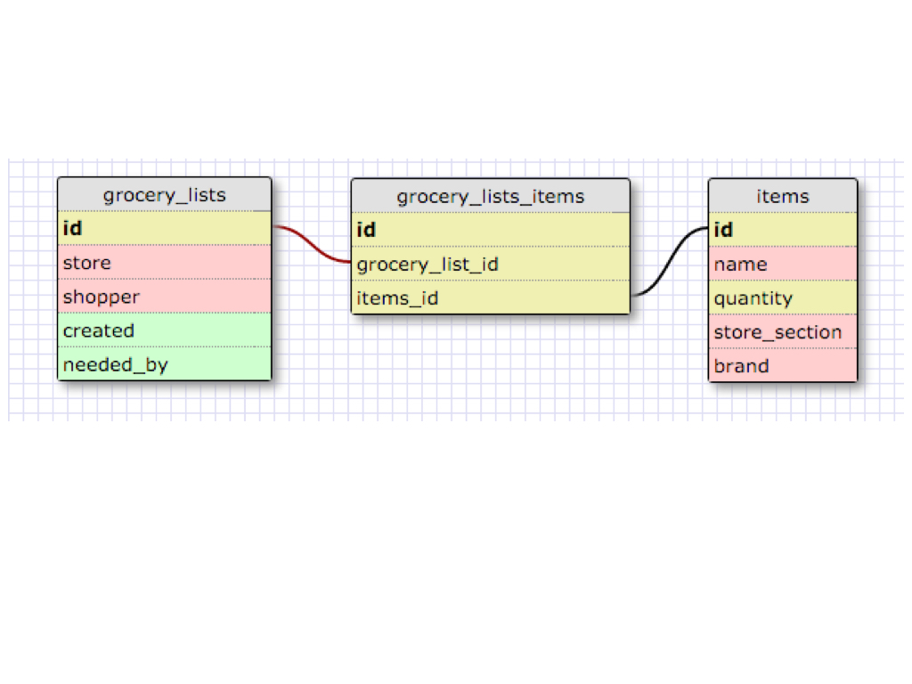

#### Release 2: One-to-One

This relationship works as each game player needs to select a civilization within the game options.  Each civilization is unique and would have its' own primary id.  I could create additional tables for maps, age, climates, water levels and etc.  
#### Release 4: Many-to-Many

#### Release 6: Reflect

What is a one-to-one database? When a database has a primary key connected to only one other foreign key.  

When would you use a one-to-one database? (Think generally, not in terms of the example you created). When you only have one table stemming from another table's foreign key.  

What is a many-to-many database? Multiple databases connected to a table.  The table will have multiple foreign keys assigned to different database's primary keys.

When would you use a many-to-many database? (Think generally, not in terms of the example you created). When multiple database tables have a relationship with one another.  They would need to be connected somehow to another table.

What is confusing about database schemas? What makes sense? Not too much doesn't make sense.  Joining tables is still a little hazy but this is fairly simple.